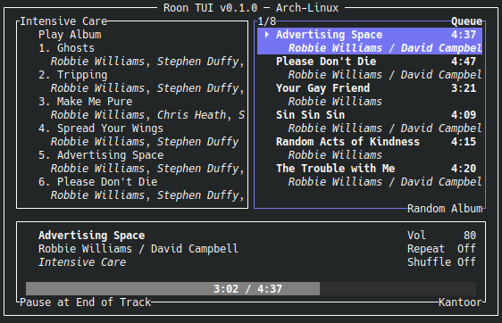
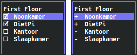

# roon-tui

### A Roon Remote for the terminal

## About


Roon TUI is a lightweight Roon Remote, providing quick access to the basic controls.

Roon TUI uses an own developed [Rust port](https://github.com/TheAppgineer/rust-roon-api) of the Roon API, instead of using the official [Node.js Roon API](https://github.com/RoonLabs/node-roon-api) provided by Roon Labs.

## Installation

### Building from Source Code
* Install Rust: visit [rustup.rs](https://rustup.rs/) and follow the provided instructions
* Clone the roon-tui git repository: `git clone https://github.com/TheAppgineer/roon-tui.git`
* Change directory and build the project: `cd roon-tui && cargo build --release`
* The binary can be found in: `target/release/roon-tui`

#### Updating
* Get the latest: `git pull`
* Rebuild: `cargo build --release`

### Downloading Release Binaries
Prebuilt binaries can be downloaded from the [latests release](https://github.com/TheAppgineer/roon-tui/releases/latest) page on GitHub. Binaries might have been created by other users for platforms I don't have access to myself.

### Using Homebrew (macOS)
User [Nepherte](https://github.com/Nepherte) created a Homebrew tap from which you can install Roon TUI. Instructions can be found at https://github.com/Nepherte/homebrew-roon.

### Using Arch User Repository (Arch Linux)
For Arch Linux users there is an entry in the [AUR](https://aur.archlinux.org/packages/roon-tui), provided by [Noa Himesaka](https://github.com/NoaHimesaka1873).

## Authorizing Core Access
On first execution the outside border of the UI will be highlighted without any views active, this indicates that pairing with a Roon Core has to take place. Use your Roon Remote and select Settings&rarr;Extensions from the hamburger menu and then Enable Roon TUI.

## Project Status
This is Beta stage software. Since its first Alpha release it has been picked up by a small group of Roon enthousiasts, who gave good feedback to bring it to this next level.

## Usage Instructions
### Command Line Options
There are command line options available to change from the default behavior, an overview is shown by requesting help:

    roon-tui -h

```
Usage: roon-tui [OPTIONS]

Options:
  -c, --config <CONFIG>     Path to the config.json file [default: config.json]
  -i, --ip <IP>             IP address of the Server, disables server discovery
  -p, --port <PORT>         Port number of the Server [default: 9330]
  -l, --log <LOG>           Path to the log file [default: roon-tui.log]
  -v, --verbose             Enable verbose logging to file
  -u, --no-unicode-symbols  Disable the use of Unicode symbols
  -h, --help                Print help
  -V, --version             Print version
```

#### Specifying Configuration File
At startup the default location to get the `config.json` configuration file from is the current working directory. This is troublesome when the executable is placed in a system folder and accessed by using the `PATH` environment variable, because the user account might not have permissions to write to that location. This can be solved by placing the configuration file somewehere in the home folder and specifying its location at startup on the command line. In the below example the file is stored in the users `.config` folder:

    roon-tui -c ~/.config/roon-tui/config.json

#### Specifying Server IP and Port
By default the server discovery functionality provided by the Roon API is used. If this doesn't work (e.g. due to the use of different subnets) the IP address and port number of the server can be specified at the command line.

Use your Roon Remote and select Settings&rarr;Displays from the hamburger menu to find the address and port in the Web display URL.

    roon-tui -i 192.168.1.10 -p 9330

#### Specifying Log File
The default location of the `roon-tui.log` log file is the current working directory. This is troublesome when the executable is placed in a system folder and accessed by using the `PATH` environment variable, because the user account might not have permissions to write to that location. This can be solved by placing the log file somewehere in the home folder and specifying its location at startup on the command line. In the below example the log file is stored in the users `.log` folder:

    roon-tui -l ~/.log/roon-tui/roon-tui.log

By default only warnings and errors (including panics) are written to the log file. More information can be stored in the log file by specifying the verbose option on the command line:

    roon-tui -v

The verbose option is meant to track down any issues, might they occur. Normally it is not adviced to use it as it results in large log files.

#### Avoiding Unicode Symbols
Roon TUI uses some unicode symbols to improve on looks. If these symbols are not correctly displayed by the terminal they can be avoided by using the `--no-unicode-symbols` option.



### Zone Selection and Grouping
The Roon zone that is controlled by Roon TUI is shown in the lower right corner and can be selected via the Zone List (requested using `Ctrl-z`).

The grouping of zones can be viewed and changed by using `Ctr-g`. Ouputs are added or removed from the group by using `Space`, the grouping is activated by using `Enter`. A set grouping can be saved as a preset using `s`, and be restored at a later time. Presets appear in the Zone List and are surrounded by square brackets: `[group-preset]`.

The Zone list also lists the ouputs that make up a currently active grouping, these outputs are surrounded by angle brackets `<output>`.

A preset or output can be selected to either group or ungroup a zone.


An inactive preset can be deleted by selection it and using `Delete`.

### Multi-character Jump in Browse View
After a list of Artists, Albums, etc. is selected, and it is known what to play, a name can be directly typed in the Browse View. The first item that matches the input will be selected. The currently matched characters are displayed in the lower left corner of the view. The Backspace key can be used to revert to previous selections, the Home keys clears the complete input.

Some important remarks:
* Relies on sort setting for Artists and Composers, type first/last name depending on setting
* Ignores "The" in item names, as this is not used in sorting, meaning "The" should not be included in the input
* Is case insensitive
* Only supports ASCII characters as input, i.e., no unicode input
* Any unicode characters in items are converted to closest ASCII match before matching takes place

### Queue Modes
Queue Modes are used to add something new to the Queue when it runs out of music, toggle between Queue Modes by using `Ctrl-q`.

Every Roon user is familiar with these two modes:
#### Manual
In the Manual Queue Mode playback stops when the queue runs out. New music has to be added manually by browsing the library.
#### Roon Radio
In the Roon Radio Queue Mode Roon takes care of adding a track to the Queue based on the last track played and its algorithms.

_Roon-TUI provides two additional Queue Modes:_
#### Random Album
In the Random Album Queue Mode a random album from the library is added to the queue. This is for those who prefer to listen to whole albums and like to re-discover their library.
#### Random Track
In the Random Track Queue Mode a random track from the library is added to the queue. This is for those who like to re-discover their library.
#### Append before running out
In the Random Album and Random Track mode new entries can be added to the Queue by using `Ctrl-a`. This can be used to fill-up the queue in advance, or to get something else if the previous addition is not to your liking.

#### Remarks
* Before the Random Album and Random Track mode become available a profile has to be selected in the Browse View using Settings -> Profile. On behalf of the selected profile tracks will be added to the queue.
* It is important to note that for the Random Album and Random Track mode to work Roon TUI has to be running.
* Queue Modes can be configured independently per zone.
* If Roon Radio is activated for a zone via a Roon Remote then the Queue Mode of that zones falls back to Roon Radio. This is because the Random Album and Random Track modes are not visible on the Roon Remote.

## Key Bindings
### Global (useable in all views)
|||
|---|---|
|Tab|Switch between views
|Shift-Tab|Reverse switch between views
|Ctrl-z|Open zone selector
|Ctrl-g|Open zone grouping
|Ctrl-Space, Ctrl-p|Play / Pause
|Ctrl-e|Pause at End of Track
|Ctrl-&uarr;|Volume up
|Ctrl-&darr;|Volume down
|Ctrl-&rarr;|Next track
|Ctrl-&larr;|Previous track
|Ctrl-q|Toggle through Queue Modes
|Ctrl-a|Append tracks according Queue Mode
|Ctrl-h|Open help screen
|Ctrl-c|Quit
### Common list controls
|||
|---|---|
|&uarr;|Move up
|&darr;|Move down
|Home|Move to top
|End|Move to bottom
|Page Up|Move page up
|Page Down|Move page down
### Browse View
|||
|---|---|
|Enter|Select
|Esc|Move level up
|Ctrl-Home|Move to top level
|F5|Refresh
|a...z|Multi-character jump to item
|Backspace|Step back in multi-character jump
### Queue View
|||
|---|---|
|Enter|Play from here
### Now Playing View
|||
|---|---|
|m|Mute
|u|Unmute
|+|Volume up
|-|Volume down
|r|Toggle Repeat
|s|Toggle Shuffle
### Zone Select Popup
|||
|---|---|
|Enter|Select Zone
|Esc|Back to previous view
|Delete|Delete inactive preset
### Zone Grouping Popup
|||
|---|---|
|Space|Add or remove output from group
|Enter|Activate Grouping
|s|Save as preset
|Esc|Back to previous view
### Text Input
|||
|---|---|
|Enter|Confirm input
|Esc|Cancel input
